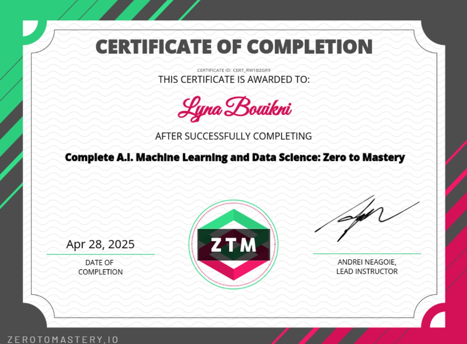

# 👋 Hi there, I'm **Lyna Bouikni**!

I'm a passionate **Data Scientist** with a strong focus on real-world applications of machine learning/deep learning. 

---

## 👩‍💻 About Me

- 🎓 Dual Master's Degrees in AI/Data Science (Dauphine–ENS–Mines Paris) & Computational Modeling (Université Côte d'Azur)
- 🧠 Experienced in Machine Learning, reinforcement learning, and multi-modal modeling
- 🌍 International experience in France 🇫🇷, Switzerland 🇨🇭, and the UAE 🇦🇪
- 💬 Multilingual: French, English, Arabic, Turkish
- 📊 Skilled in Python, ML, DL

---

## 🚀 Current Focus

🔭 Applying data science to **real-world problems** 
📚 Building reproducible **ML pipelines** for real-world data
📝 Contributing to open-source & scientific publications

---

## 🧠 Technical Skills

**Languages & Tools:**

```text
Python, R, SQL, Java, C | Scikit-learn, TensorFlow, Keras, PyTorch
Pandas, NumPy, Matplotlib, Seaborn | Git, GitLab, Linux, Jupyter, GCP
```

**Domains:**

- Machine Learning & Deep Learning
- Biomedical Data Analysis (EEG, MRI, health records)
- Reinforcement Learning, Multi-agent systems
- Data Visualization & Explainability

---

## 📂 Featured Projects

### 🫀 [Heart Disease Risk Prediction](https://github.com/LynaBouikni/Heart-Disease-Prediction)  
> **Tools**: Scikit-Learn · SHAP · Pandas · Matplotlib  
> **Tags**: Classification · Healthcare · Explainability · Portfolio

End-to-end ML pipeline using the UCI Heart dataset with:
- EDA, model tuning (LogReg, RF, KNN), cross-validation
- SHAP-based model explainability for clinical interpretation
- Clear markdown structure, visual summaries, and performance metrics

📌 [View Project on GitHub](https://github.com/LynaBouikni/Heart-Disease-Prediction)


### 🧠 Deep RL for motor adaptation (Campus Biotech)
Simulated human-like movement adaptation using MuJoCo + reinforcement learning.

### 🧠 Speech decoding with EEG & fMRI (UAEU)
Transformer-based model achieving 97% accuracy on unimodal EEG decoding. (Will be shared once published)

### 🧮 IRM-based tumor classification
Multi-level classification system with handcrafted statistical features & ML.

---

## 🧾 Certifications

- Machine Learning and Data Science - Zero To Mastery Academy

<p align="center">
  
</p>


---

## 🤝 Let’s Connect

📫 Email: [lynabouiknia@gmail.com](mailto:lynabouiknia@gmail.com)  
🔗 [LinkedIn](https://linkedin.com/in/lyna-b-231a41126)  
📁 [Portfolio (Coming soon!)]()

---

_Always curious. Always learning. Always building._


<!--
**LynaBouikni/LynaBouikni** is a ✨ _special_ ✨ repository because its `README.md` (this file) appears on your GitHub profile.

Here are some ideas to get you started:

- 🔭 I’m currently working on ...
- 🌱 I’m currently learning ...
- 👯 I’m looking to collaborate on ...
- 🤔 I’m looking for help with ...
- 💬 Ask me about ...
- 📫 How to reach me: ...
- 😄 Pronouns: ...
- ⚡ Fun fact: ...
-->
